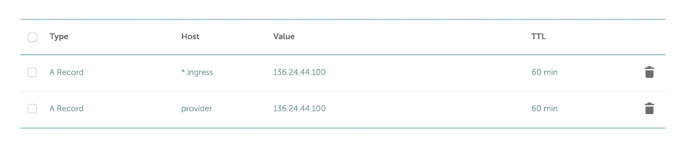

# Ubic Provider Daemon


This folder contains the Ubic Provider Daemon. This piece of software listens to events emitted from the Ubic blockchain and takes actions on a connected Kubernetes cluster to provision compute capacity based on the bids that the configured provider key wins. The following are the pieces of the daemon:


## Structure

### [`bid`](./bid)

The bid engine queries for any existing orders on chain, and based on the on-chain provider configuration, places bids on behalf of the configured provider based on configured selling prices for resources. The daemon listens for changes in the configuration so users can use automation tooling to dynamically change the prices they are charging w/o restarting the daemon.Handle on chain contract events and complete POR challenges

### [`cluster`](./cluster)

The cluster package contains the necessary code for interacting with clusters of compute that a `provider` is offering on the open marketplace to deploy orders on behalf of users creating `deployments` based on `manifest`s. Right now only `kubernetes` is supported as a backend, but `providers` could easily implement other cluster management solutions such as OpenStack, VMWare, OpenShift, etc...


### [`gateway`](./gateway)

Contains hanlder code for the rest server exposed by the `provider`

## Build
```
go mod tidy
go build .
```
## Config file
The following content config the template
```
{
  "NodeURL":"http://192.168.1.123:30010",--You are advised to use the official or local http service ip address :port need -ethcompatible
  "NodeChainID": "172",
  "CPUPrice": "1000000000", --Order quote cpu a core of 1000 copies, quote precision bit value, chain accuracy of 18 bits
  "MemoryPrice": "10000000", -- quote precision bit value, chain accuracy of 18 bits
  "StoragePrice": "1000000", -- quote precision bit value, chain accuracy of 18 bits
  "SecretKey": "you private key", -- Please enter your private key
  "ProviderAddress": "0x624199661664b9EF607c02D934EA25701076C3B8",-- Please enter your address
  "OrderFactory": "0x495621f53EB82371dA50A256b5637421D3a79776",-- Please enter orderfactory address
  "ProviderContract": "0x725440598D4fE96523D7491FD198fd6D4f5884e5",-- Please enter providercontract address
  "ProviderFactoryContract": "0x000000000000000000000000000000000000C003",
  "ValidatorFactoryContract": "0x000000000000000000000000000000000000C002",
  "BidTimeOut": 600,
  "NameSpace": "ubic-service",
  "K8sConfigPath": "./admin.conf", -- Enter the access configuration file path of the k8s cluster
  "Cert": "0xB3ce612Cf77D4e2F7CD6dea0651C90bD0295b2b3",-- Please enter cert address
  "GatewayListenAddress": "0.0.0.0:8443", -- This listening address is used by the provider to provide rpc for ordinary users to query the instance status and communicate with the instance
  "DeploymentIngressDomain":"ingress.daemon.com", -- Configure the domain name you intend for the user
  "DeploymentIngressExposeLBHosts":"false",
  "DeploymentIngressStaticHosts":"true",
  "DeploymentNetworkPoliciesEnabled":"true",
  "ClusterPublicHostname":"provider.daemon.com", -- Configure the domain name for which you provide services to users
  "OvercommitPercentCPU":"0",
  "OvercommitPercentMemory":"0",
  "OvercommitPercentStorage":"0",
  "DeploymentRuntimeClass":"",
  "DockerImagePullSecretsName":"",
  "HostNameServiceListenAddr": "0.0.0.0:28443",
  "HostPruneInterval": 600,
  "HostWebRefreshInterval": 5,
  "HostRetryDelay": 3

}
```
## Deployment process

### 1. Registered provider identity

use wallet to call provider factory contract

### 1. install Kubernetes Cluster

Refer to the Kubernetes Cluster official tutorial

### 2. Domain Name Review

Add DNS (type A) records for your Ubic Provider related domains on your DNS hosting provider.
```
*.ingress.yourdomain.com

provider.yourdomain.com
```
**ingress.yourdomain.com needs to point to ingress nginx in the k8s cluster.**

**provider.yourdomain.com must point to the port monitored by the gatewaylistenaddress provided by the provider serivce.**
> NOTE - do not use Cloudflare or any other TLS proxy solution for your Provider DNS A records.
> NOTE - Instead of the multiple DNS A records for worker nodes, consider using CNAME DNS records such as the example provided below.  CNAME use allows ease of management and introduces higher availability.
>
> *.ingress 300 IN CNAME nodes.yourdomain.com.
> nodes 300 IN A x.x.x.x
> nodes 300 IN A x.x.x.x
> nodes 300 IN A x.x.x.x
> provider 300 IN CNAME nodes.yourdomain.com.
**Example DNS Configuration**

### 3. installer ingress for Kubernetes Cluster
1. Install Helm on a Kubernetes Master Node
```
wget https://get.helm.sh/helm-v3.9.4-linux-amd64.tar.gz

tar -zxvf helm-v3.9.4-linux-amd64.tar.gz

mv linux-amd64/helm /usr/local/bin/helm

```
2. Kubernetes Configurations
```
kubectl create ns ubic-service
kubectl label ns ubic-service ubic.net/name=ubic-service ubic.net=true

kubectl create ns ingress-nginx
kubectl label ns ingress-nginx app.kubernetes.io/name=ingress-nginx app.kubernetes.io/instance=ingress-nginx

kubectl create ns lease
kubectl label ns lease ubic.net=true
kubectl apply -f ./src/ubicpkg/api/crd_v1.yaml
```
3. Copy ubic-ingress-1.2.6.tgz file to the machine on which helm is installed
4. Unzip file
```
tar xvfg ubic-ingress-1.2.6.tgz
```
5. install ingress-controller
```
helm install ubic-ingress ./ubic-ingress -n ingress-nginx --set domain=ingress.youdomain.com
```
> TIPS. To install the Kubernate on an uninstalled server, change the ingress port mode from ClusterIP to NodePort
### 4. Run providerService
```
nohup ./providerService  >> output.log 2>&1 &
```

   
